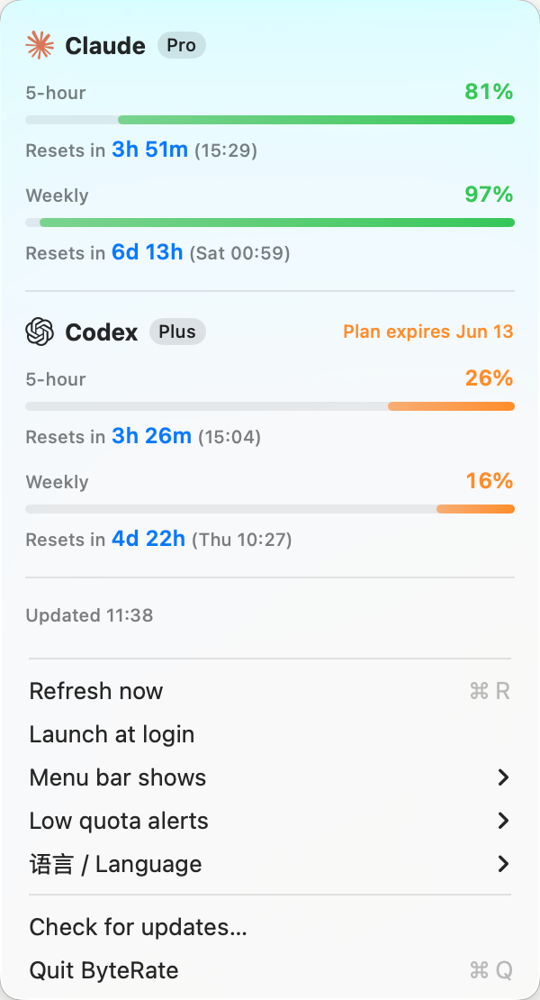

# ByteRate 🔥

**English** | [简体中文](README.zh-CN.md)


A tiny macOS menu bar app that shows your remaining **Claude** and **Codex** quota at a glance — built specifically for Claude Pro/Max and ChatGPT Plus/Pro subscribers who work with the `claude` and `codex` CLIs.



## Why ByteRate

Subscription plans come with rolling usage windows (5-hour and weekly). When you're deep in work, the last thing you want is to hit the limit without warning — or to dig through chats and dashboards to find out how much is left.

ByteRate puts the answer in your menu bar. Nothing more.

- **No separate app login** — no API key and no ByteRate account. It reuses the OAuth credentials your `claude` / `codex` CLIs already have on this Mac. Quota fetching talks only to first-party Anthropic/OpenAI endpoints; nothing is collected.
- **Zero burden** — a single ~1 MB native app. No Electron, no background daemon, no dock icon. Polls every 5 minutes (every 2 minutes when a window drops below 20%), and refreshes tokens automatically so it just keeps working.
- **One panel, everything** — both providers side by side: 5-hour window, weekly window, time until reset, plan badge, and Codex subscription expiry. No tabs, no switching.

## Features

- Menu bar shows remaining percentage per provider — choose 5-hour window (default), weekly window, lowest of both, or icons only
- Burn-style progress bars: colored remainder on the right, burned-away on the left, color shifts green → orange → red
- Reset countdown ("resets in 3h 51m (14:00)") for every window
- Low-quota notifications with a provider mark — pick any of below 20% / 10% / 5%, off by default; one alert per window per reset cycle, no spam (subscription-expiry alerts follow the same switch)
- Subscription expiry shown for Codex (the Claude API doesn't expose an expiry date)
- Show one provider or both — auto-detected from local credentials on first launch
- English / 中文 interface, follows your system language
- Launch at login, manual refresh (⌘R), update check


## Requirements

- macOS 13+
- A Claude Pro/Max and/or ChatGPT Plus/Pro **subscription**, signed in via the [Claude Code](https://github.com/anthropics/claude-code) or [Codex](https://github.com/openai/codex) CLI on this Mac

> Note: ByteRate reads subscription rate-limit windows. API-key (pay-as-you-go) and relay/proxy accounts don't have these quotas and are not supported.

## Install

### Install script (recommended)

The fastest path — no Homebrew needed. Downloads the latest release, installs to `/Applications`, removes quarantine for this unsigned app, and opens it:

```sh
curl -fsSL https://raw.githubusercontent.com/mhmh-X/byterate/main/scripts/install.sh | bash
```

If you'd rather inspect it first, read [scripts/install.sh](scripts/install.sh).

To update, just run it again.

### Homebrew

```sh
brew tap mhmh-X/byterate https://github.com/mhmh-X/byterate
brew trust mhmh-x/byterate
brew update
brew install --cask byterate
```

Upgrade later with `brew update && brew upgrade --cask byterate`.

> Homebrew may ask you to trust this tap before loading the cask because it is not an official Homebrew tap. The app is not notarized by Apple yet, so the install script and the cask remove the quarantine attribute after install — otherwise Gatekeeper would block it. If you'd rather not have that done for you, build from source instead.

### Build from source

Requires Xcode Command Line Tools only (`xcode-select --install`):

```sh
git clone https://github.com/mhmh-X/byterate && cd byterate
make install
open /Applications/ByteRate.app
```

## First launch

If Claude is enabled, the first quota fetch asks for keychain access to read the Claude Code credential — click **Always Allow** and it won't ask again. Codex credentials are read from `~/.codex/auth.json`, no prompt needed. Enabling notifications will ask for notification permission once.

## Privacy

Credentials are read locally and sent only to first-party Anthropic/OpenAI hosts: `api.anthropic.com` / `claude.ai` and `chatgpt.com` / `auth.openai.com`. These quota endpoints are not public stable APIs and may change; ByteRate fails closed instead of guessing if the response shape is not recognized. The only other network request is the manual "Check for updates" action, which queries the GitHub Releases API. No other servers, no analytics, no data collection. When a token expires, ByteRate refreshes it and writes it back where each CLI keeps it (Claude in the keychain, Codex in `~/.codex/auth.json`), so the panels stay fresh even if you rarely open the CLI, and the CLIs stay signed in.

## Troubleshooting

- **No credentials found** — sign in with the relevant CLI first, then refresh ByteRate.
- **Installed with Homebrew but no menu bar item** — run `open /Applications/ByteRate.app`. If it still doesn't appear, switch to Finder or hide a few crowded menu bar icons; macOS can hide status items behind the notch or app menus.
- **Homebrew checksum mismatch** — your local tap is stale. Run `brew update` and retry. If it still fails: `brew untap mhmh-X/byterate && brew tap mhmh-X/byterate https://github.com/mhmh-X/byterate && brew install --cask byterate`.
- **401 / missing token** — run the CLI login again (`codex login`, or sign in to Claude Code).
- **429 rate-limited** — wait a few minutes; ByteRate backs off and retries automatically.
- **Unrecognized usage response** — Anthropic/OpenAI likely changed a private quota endpoint. Update ByteRate or open an issue with the error text.

## Acknowledgements

ByteRate is inspired by [CodexBar](https://github.com/steipete/CodexBar) — a great, full-featured menu bar tool by [@steipete](https://github.com/steipete), and the project that proved this credential-reuse approach works. Go check it out.

The difference is scope. CodexBar supports many providers, usage history, cost tracking, and much more. ByteRate deliberately does one thing: show remaining 5-hour/weekly quota for Claude + Codex subscribers in a single panel. If you want the full dashboard, use CodexBar; if you want a glance, ByteRate is for you.

## License

[MIT](LICENSE)
