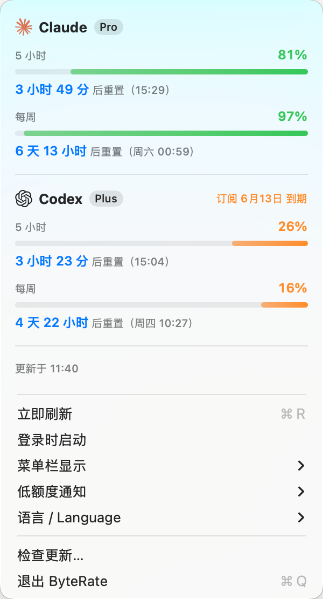

# ByteRate 🔥

[English](README.md) | **简体中文**


极简 macOS 菜单栏工具，一眼看到 **Claude** 和 **Codex** 的剩余额度——专为使用 `claude` / `codex` CLI 的 Claude Pro/Max 和 ChatGPT Plus/Pro 订阅用户打造。



## 为什么做 ByteRate

订阅套餐的额度是滚动窗口制（5 小时窗 + 周窗）。干活干得正起劲时突然撞上限额，或者为了查剩多少额度翻聊天记录、开网页后台，都很扫兴。

ByteRate 把答案放在菜单栏上，仅此而已。

- **无需单独登录**——不用填 API key，也没有 ByteRate 账号。直接复用本机 `claude` / `codex` CLI 已有的 OAuth 凭据。额度获取只请求 Anthropic/OpenAI 第一方接口，不收集任何数据。
- **零负担**——单个约 1 MB 的原生应用。没有 Electron、没有后台守护进程、不占 Dock。每 5 分钟自动刷新（额度跌破 20% 时缩短到每 2 分钟），token 过期自动续，装完就不用管。
- **一屏看全**——两家服务商并排展示：5 小时窗、周窗、重置倒计时、套餐徽章、Codex 订阅到期时间。不用切页签。

## 功能

- 菜单栏直接显示各家剩余百分比——可选 5 小时窗（默认）/ 周窗 / 两窗最低值 / 纯图标
- "燃烧式"进度条：右侧彩色是剩余，左侧灰色是烧掉的，颜色随余量绿 → 橙 → 红
- 每个窗口都有重置倒计时（"3 小时 51 分后重置（14:00）"）
- 低额度系统通知（带服务商标记）——剩余低于 20% / 10% / 5% 任选，默认关闭；同一窗口每个重置周期只提醒一次，不骚扰
- 面板展示 Codex 订阅到期时间（Claude 接口不提供到期日期，故不显示）；开启通知后临期 3 天内会提醒
- 可只显示一家——首次启动按本机登录情况自动选择
- 中文 / English 双语界面，默认跟随系统
- 登录时自启、手动刷新（⌘R）、检查更新

## 使用要求

- macOS 13+
- 拥有 Claude Pro/Max 或 ChatGPT Plus/Pro **订阅**，并已在本机通过 [Claude Code](https://github.com/anthropics/claude-code) 或 [Codex](https://github.com/openai/codex) CLI 登录

> 说明：ByteRate 读取的是订阅版的滚动限额窗口。API key（按量付费）用户和中转站账号没有这类额度，不在支持范围内。

## 安装

### 安装脚本（推荐）

最快的方式，不需要 Homebrew。自动下载最新版本、安装到「应用程序」、为这个未签名应用解除 quarantine 隔离并打开：

```sh
curl -fsSL https://raw.githubusercontent.com/mhmh-X/byterate/main/scripts/install.sh | bash
```

如果想先看脚本内容，可以打开 [scripts/install.sh](scripts/install.sh)。

升级时再跑一遍即可。

### Homebrew

```sh
brew tap mhmh-X/byterate https://github.com/mhmh-X/byterate
brew trust mhmh-x/byterate
brew update
brew install --cask byterate
```

升级：`brew update && brew upgrade --cask byterate`。

> Homebrew 可能会要求你先信任这个 tap，因为它不是官方 Homebrew tap。应用暂未经过 Apple 公证，安装脚本和 cask 都会在安装后移除 quarantine 隔离属性（否则 Gatekeeper 会拦截）。介意此行为请改用源码安装。

### 源码安装

只需 Xcode Command Line Tools（`xcode-select --install`），无需完整 Xcode：

```sh
git clone https://github.com/mhmh-X/byterate && cd byterate
make install
open /Applications/ByteRate.app
```

## 首次运行

若启用了 Claude，第一次拉取额度会请求钥匙串授权（读取 Claude Code 凭据），点 **「始终允许」** 即可，之后不再询问；Codex 凭据从 `~/.codex/auth.json` 读取，无需授权。首次开启低额度通知时会请求一次通知权限。

## 隐私

凭据只在本机读取，只发往 Anthropic/OpenAI 第一方主机：`api.anthropic.com` / `claude.ai` 和 `chatgpt.com` / `auth.openai.com`。这些额度接口不是公开稳定 API，未来可能变化；如果返回结构无法识别，ByteRate 会报错而不是猜测额度。唯一的额外网络请求是你手动点「检查更新」时查询 GitHub Releases API。除此之外没有任何其他服务器、没有统计埋点、不收集任何数据。对 Claude，ByteRate 只**读取**钥匙串、从不刷新或写回凭据，因此不会干扰 Claude Code 自己对钥匙串的访问（Codex 的 token 仍在 `~/.codex/auth.json` 里自动续期）。若 Claude token 已过期、而你一阵子没用 Claude Code，该栏会提示「用一次 Claude Code 即可」，等 CLI 自己续上。

## 排障

- **找不到凭据**——先用对应 CLI 登录，再刷新 ByteRate。
- **Homebrew 装完但菜单栏没有图标**——执行 `open /Applications/ByteRate.app`。如果仍看不到，先切到 Finder 或收起几个菜单栏图标；macOS 可能会把状态栏图标藏在刘海或当前应用菜单后面。
- **Homebrew checksum mismatch / 校验失败**——本地 tap 缓存旧了。先执行 `brew update` 后重试；仍失败则执行：`brew untap mhmh-X/byterate && brew tap mhmh-X/byterate https://github.com/mhmh-X/byterate && brew install --cask byterate`。
- **401 / token 缺失**——重新执行 CLI 登录（`codex login`，或在 Claude Code 中重新登录）。
- **429 被限流**——等几分钟即可，ByteRate 会自动退避重试。
- **接口返回结构无法识别**——Anthropic/OpenAI 可能调整了私有额度接口。请更新 ByteRate，或带上错误文案提交 issue。

## 致谢

ByteRate 的灵感来自 [@steipete](https://github.com/steipete) 的开源项目 [CodexBar](https://github.com/steipete/CodexBar)——一个功能完备的优秀菜单栏工具，也是验证了"复用 CLI 凭据"这条路可行的先行者，推荐了解。

两者的区别在于定位：CodexBar 支持多家服务商、用量历史、成本统计等丰富功能；ByteRate 刻意只做一件事——把 Claude + Codex 订阅的 5 小时/周剩余额度放在同一个面板里。想要全功能仪表盘，用 CodexBar；只想扫一眼余量，ByteRate 就是为你做的。

## 许可证

[MIT](LICENSE)
